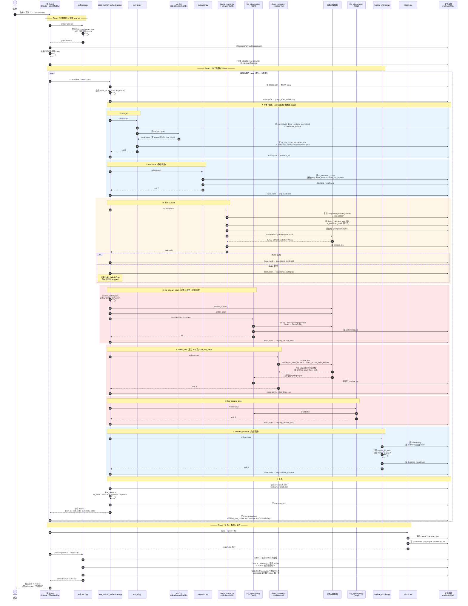

# trtc-eval — TRTC 知识库评测工具

> 内部 skill，用于度量 `trtc` skill + 知识库（slices/scenarios）在真实 AI CLI 调用下的端到端质量。
> 一句话定义：**给 AI 一道题（一个 case），让它生成代码，把代码注入真机/模拟器跑起来，再看结果是否符合预期**。

---

## 0. Configuration（首次使用必读）

TRTC 测试凭据通过本目录下的 `config.json` 维护——该文件已 `.gitignore`，含真实 SDKAppID / UserSig，**不要提交**。

```bash
cp .claude/skills/trtc-eval/config.example.json .claude/skills/trtc-eval/config.json
# 编辑 config.json，填入真实值
```

Required 字段（`trtc_test_account` 下）：

- `sdk_app_id`（positive integer）
- `user_id`（non-empty string）
- `user_sig`（non-empty string；由业务后端签发）

**回退链（per-field）**：config.json 每个字段非空时优先使用；字段为空 / 为 `replace-me` 占位符时，回落到同名 shell env vars（`TRTC_TEST_SDKAPPID` / `TRTC_TEST_USERID` / `TRTC_TEST_USERSIG`）——方便 CI 用 secret injection 而不落盘。

三源都无时 `selfcheck --phase=pre-run` 直接 fail，`creds_loadable` 错误会指向 `config.example.json`。

**其他环境变量仍走 shell env**（未搬进 config）：`EVAL_DEVELOPMENT_TEAM`（iOS 真机签名）、`EVAL_DEVICE_POLICY`（模拟器 / 真机偏好）。等以后有明确痛点再收敛。

---

## 1. 设计目标

| 关注点 | 在本项目里如何体现 |
|---|---|
| **可复现** | 同一份 `cases.json` + 同一份模板项目 + 固定环境变量 → 同一份 `summary.json` |
| **可信任** | 三道闸门（Gate A/B/C）+ EVAL_RUN_NONCE 挑战字 + AST 扫描，结果可被审计；任何篡改产物会被 `selfcheck` 判为 `TAINTED` |
| **可对比** | 每次 run 都落到独立的 `eval-runs/{ISO8601}/`，`report.py diff` 直接出回归/修复清单 |
| **不污染主 Agent** | 主 Agent **只读** `summary.json` / `report.md` / `run.manifest.json` 三类文件，所有重逻辑在脚本里完成 |

---

## 2. 项目架构（资源全景）

trtc-eval 的物理资产**全部收拢在 skill 目录下**，仅 `.claude/eval-runs/`（每次运行的产物）留在仓库根，与其它 skill 的 runtime 数据并列：

```
trtc-ai-integration/
├── .claude/skills/trtc-eval/        ← skill 全部源码 / 资产
│   ├── SKILL.md                     #   主指令（触发条件、3 步执行流、铁律）
│   ├── README.md                    #   本文件
│   ├── config.json                  #   TRTC 测试凭据（gitignore）
│   ├── config.example.json          #   配置示例
│   ├── docs/
│   │   ├── quality-self-check.md    #   三闸门说明
│   │   └── troubleshooting.md       #   常见错误码与修复方法
│   ├── prompts/
│   │   └── ai_driver_system_prompt.md   # AI CLI 评测模式系统提示词
│   ├── bootstrap.sh                 #   一次性环境初始化（pip install + clone templates）
│   ├── scripts/                     #   评测引擎（生产代码，trace.jsonl 唯一写入方）
│   │   ├── case_runner_orchestrator.py  #   ★ 唯一编排入口，串联 7 个步骤
│   │   ├── run_ai.py                #   Step 1：调 CLI 拿代码 + 提取 fenced blocks
│   │   ├── evaluator.py             #   Step 2：静态评分（must_include/must_not_include）
│   │   ├── demo_runner.py           #   Step 3/5：build / run（注入代码 + 编译 + 启动）
│   │   ├── log_streamer.py          #   Step 4/6：日志流 start / stop（独立进程）
│   │   ├── runtime_monitor.py       #   Step 7：解析 runtime.log → 动态评分
│   │   ├── selfcheck.py             #   质量自检（pre-run / post-run / cases-lint）
│   │   ├── report.py                #   报告生成（build / diff）
│   │   ├── stats_trigger.py         #   触发率统计（30d 窗口）
│   │   ├── requirements.txt         #   pydantic + jsonschema
│   │   ├── package.json             #   puppeteer 等评测专属 Node 依赖
│   │   ├── log-bridge.mjs           #   web 日志桥（puppeteer 抓 console）
│   │   └── lib/                     #   被脚本复用的库代码
│   │       ├── eval_config.py       #     ★ skill_root() / repo_root() 路径锚点
│   │       ├── schemas.py           #     Pydantic 数据契约（Case / *Result / Trace）
│   │       ├── cli_driver.py        #     封装 `claude` / `codebuddy` CLI 调用
│   │       ├── code_injector.py     #     按 demo_injection_map 把代码注入模板
│   │       ├── builder.py           #     构建分发（dispatch 到平台 adapter）
│   │       ├── launcher.py          #     启动分发（dispatch 到平台 adapter）
│   │       ├── dep_installer.py     #     安装 AI 声明的依赖（pod / gradle / npm）
│   │       ├── template_fetcher.py  #     从 templates/ 复制工程到 case workspace
│   │       ├── device_picker.py     #     设备选择（kind/SDK/booted 三段排序）
│   │       ├── web_profile.py       #     web 框架 profile 叠加
│   │       ├── platforms/           #     iOS / Android / Web 平台 adapter
│   │       └── log_parsers/         #     syslog / logcat / puppeteer 解析器
│   ├── tests/
│   │   ├── benchmark/
│   │   │   ├── cases.json           #   ← 评测集（单一事实源）
│   │   │   └── schema.json          #     cases.json 的 JSON Schema
│   │   └── unit/                    #   开发期 pytest，不会被生产脚本 import
│   │       ├── test_orchestrator.py
│   │       ├── test_log_parsers.py
│   │       └── fixtures/            #     parser 单测样本（生产代码禁止读取）
│   ├── templates/                   #   bootstrap.sh 拉取的模板工程（gitignore）
│   │   ├── ios-demo/
│   │   ├── android-demo/
│   │   └── web-demo/
│   └── .cache/                      #   bootstrap.sh 的 sparse-checkout 缓存（gitignore）
│       └── project_template/
│
└── .claude/eval-runs/{ts}/          ← 每次 run 的产物根目录（gitignore，留在仓库根）
    ├── run.manifest.json            #   主 Agent 写：本次 run 选了哪些 case
    ├── selfcheck.json               #   selfcheck.py 写
    ├── scoreboard.csv               #   report.py 写
    ├── report.md                    #   report.py 写
    └── cases/{test_id}/             #   每个 case 一个独立目录
        ├── trace.jsonl              #   ★ orchestrator 独家写入
        ├── input.json               #   run_ai.py 写：prompt + token 估算
        ├── ai_raw_output.md         #   run_ai.py 写：CLI 原始输出
        ├── dependencies.json        #   run_ai.py 写：从输出抽取的 dep 块
        ├── ai_extracted_code/       #   run_ai.py 写：从输出抽取的 fenced 代码
        ├── workspace/               #   demo_runner.py 写：模板 + 注入后的工程
        ├── compile.log              #   demo_runner.py 写：编译日志
        ├── runtime.log              #   log_streamer.py 写：设备/模拟器日志
        ├── runtime.log.pid          #   log_streamer.py 写：日志流 PID
        ├── static_result.json       #   evaluator.py 写
        ├── dynamic_result.json      #   runtime_monitor.py 写
        └── summary.json             #   ★ orchestrator 写：主 Agent 唯一应该读的文件
```

### 路径锚点（重要）

所有脚本通过 `scripts/lib/eval_config.py` 的 `skill_root()` / `repo_root()` 解析数据路径，**不依赖 cwd**。这意味着：

- `cases.json` / `templates/` / `prompts/` 等都通过 `skill_root() / "..."` 拼接绝对路径
- `.claude/eval-runs/` 通过 `repo_root() / ".claude" / "eval-runs"` 拼接，永远落在仓库根
- 你可以从任意目录调脚本，但建议在 skill 目录下执行（`bootstrap.sh` 也会 cd 到自己所在目录）

### 三层关系图

```mermaid
graph TB
    subgraph L3["指令层 — .claude/skills/trtc-eval/"]
        S[SKILL.md<br/>主 Agent 行为契约]
        P[prompts/<br/>AI 评测模式提示词]
        D[docs/<br/>三闸门 / 排障]
    end

    subgraph L2["引擎层 — scripts/"]
        O[case_runner_orchestrator.py<br/>★ 唯一编排入口]
        SUB[run_ai · evaluator · demo_runner<br/>log_streamer · runtime_monitor]
        CHK[selfcheck.py]
        RPT[report.py]
        LIB[lib/<br/>schemas · platforms · log_parsers]
    end

    subgraph L1["数据层"]
        C[tests/benchmark/cases.json]
        T[templates/{platform}-demo/]
        R[.claude/eval-runs/{ts}/]
    end

    S -->|主 Agent 调用| O
    S -->|主 Agent 调用| CHK
    S -->|主 Agent 调用| RPT
    O -->|subprocess| SUB
    SUB --> LIB
    CHK --> LIB
    RPT --> LIB
    O -->|读| C
    SUB -->|读| C
    SUB -->|读| T
    P -.被 run_ai.py 读取.-> SUB
    O -->|写| R
    SUB -->|写| R
    CHK -->|读| R
    RPT -->|读| R
```

---

## 3. 端到端执行流程（时序图）

下面这张图把 **主 Agent → orchestrator → 7 步子脚本 → 产物** 的完整因果链画清楚。



### 关键不变量

| 不变量 | 由谁守护 | 违反后果 |
|---|---|---|
| `trace.jsonl` 只能由 orchestrator 写 | 子脚本注释 + selfcheck Gate C | post-run 判 `TAINTED` |
| `EVAL_RUN_NONCE` 全局单一来源（orchestrator 生成） | `runtime_monitor` 只读不生成；`log_streamer` 只透传 | post-run 检测到 nonce 不在日志中 → `TAINTED` |
| 7 步严格顺序，不可乱序、不可并发 | orchestrator 的 `STEPS` 列表 + selfcheck Gate C | trace_order 检查失败 |
| `cases.json` 是评测集唯一事实源 | 6 个脚本统一读 `tests/benchmark/cases.json` | 改了案例所有脚本立即可见 |
| 主 Agent 只读 3 类文件 | SKILL.md 行为契约（软约束） | 上下文污染（不会被自动检测，事后审计） |

---

## 4. 评分模型

```
StaticResult.score   = w_must_include      * (hits / |must_include|)
                     + w_must_not          * ((|must_not_include| - dirty) / |must_not_include|)

DynamicResult.score  = compile_ok ? (
                         w_events          * (events_captured / expected_events)
                       + w_compile_bonus   * 1
                       ) : 0

Summary.final_score  = w_static_in_final  * StaticResult.score
                     + w_dynamic_in_final * DynamicResult.score

passed = (static.score >= acceptance.static_score_min)
       ∧ (dynamic.score >= acceptance.dynamic_score_min)
       ∧ (acceptance.must_compile ⇒ dynamic.compile_ok)
```

权重和阈值在 `cases.json` 的每条 case 内独立定义（`weights` / `acceptance`）。**不允许在 skill 提示词里出现公式**——所有计算只在 `evaluator.py` / `runtime_monitor.py` / `case_runner_orchestrator._build_summary` 里发生。

---

## 5. 主 Agent 调用契约

主 Agent 在执行评测时**只允许**做下面这些事（先 `cd .claude/skills/trtc-eval/`）：

```bash
cd .claude/skills/trtc-eval

# Step 1
python scripts/selfcheck.py --phase=pre-run
cat tests/benchmark/cases.json                     # 读 case 元数据
mkdir -p ../../../.claude/eval-runs/{ts}           # 创建 run dir（落在仓库根）
echo '{...}' > ../../../.claude/eval-runs/{ts}/run.manifest.json

# Step 2（每个 case 一次）
python scripts/case_runner_orchestrator.py \
  --case-id=TC-LIVE-IOS-006 \
  --run-dir=../../../.claude/eval-runs/{ts}
# orchestrator 的 stdout 只有一行 JSON：{"test_id":...,"exit_code":...,"summary_path":...}
cat ../../../.claude/eval-runs/{ts}/cases/TC-LIVE-IOS-006/summary.json

# Step 3
python scripts/report.py build --run-dir=../../../.claude/eval-runs/{ts}
python scripts/selfcheck.py --phase=post-run --run-dir=../../../.claude/eval-runs/{ts}
cat ../../../.claude/eval-runs/{ts}/report.md
```

**禁止**主 Agent 做的事（写在 SKILL.md 铁律里）：

- 读 `ai_raw_output.md` / `runtime.log` / `compile.log`（上下文污染源）
- 在主 Agent 里手写评分公式
- 跳过 selfcheck 直接出报告
- 编造数据填补失败步骤（应该把失败透传给 report）

---

## 6. 环境依赖

| 类别 | 项 | 备注 |
|---|---|---|
| **Python** | 3.10+，`pydantic>=2.5`、`jsonschema>=4.20` | `bootstrap.sh` 自动 pip install |
| **AI CLI** | `claude` 或 `codebuddy` 至少一个可用 | `selfcheck pre-run` 校验 |
| **环境变量** | `TRTC_TEST_SDKAPPID`、`TRTC_TEST_USERID`、`TRTC_TEST_USERSIG` | 测试账号，App 内通过 env 注入 |
| **可选环境变量** | `EVAL_DEVICE_POLICY`（默认 `prefer-simulator`）、`EVAL_RUN_DURATION_SEC`（默认 60）、`EVAL_CLI_TIMEOUT_SEC` | |
| **iOS 工具链** | `xcodebuild` + `xcrun simctl` + `idb`（或 `devicectl`） | 仅 iOS case 需要 |
| **Android 工具链** | `adb` + Android Studio SDK | 仅 Android case 需要 |
| **Web 工具链** | `node` + `puppeteer`（通过 npm） | 仅 Web case 需要 |
| **系统工具** | `ripgrep` (`rg`) | evaluator/selfcheck grep；缺失时回退到纯 Python |

---

## 7. 一次性初始化

```bash
cd .claude/skills/trtc-eval

# 安装依赖 + 拉取模板工程到 templates/
./bootstrap.sh

# 安装 + 校验
./bootstrap.sh --verify
```

`bootstrap.sh` 会先 `cd` 到自己所在的 skill 目录，然后做 5 件事：

1. 校验 Python 3.10+ 并 `pip install -r scripts/requirements.txt`
2. 检查 `rg`（必需）/ `xcodebuild` / `adb` / `node`（按平台需要）
3. 用 sparse-checkout 从 `Hanpto/project_template` 拉 `ios/MyApplication`、`android/MyApplication`、`web/MyApplication` 到 `templates/{platform}-demo/`（缓存写到 `.cache/project_template/`）
4. 把 `INJECTION.json` 里的 `pinned_commit` 写成具体 SHA（审计用）
5. 在仓库根创建 `.claude/eval-runs/`（产物目录），并视情况跑 `selfcheck pre-run`

> 模板缺失时 orchestrator 会 fallback 自动调一次 `bootstrap.sh`（见 `_ensure_templates`），但不建议依赖这条路径——首次使用务必手动跑。

---

## 8. 故障速查

| 症状 | 退出码 | 看哪 | 怎么修 |
|---|---|---|---|
| pre-run 自检失败 | 1 | `.claude/eval-runs/selfcheck_prerun.json` | 按报错项逐条修（最常见：env 没设） |
| CLI 调用超时 | 124 | `case/X/input.json` 中 `status:timeout` | `EVAL_CLI_TIMEOUT_SEC=600` 或检查网络 |
| 编译失败 | 2 | `case/X/compile.log` | 看 INJECTION.json 是否对应当前 case |
| 没设备 | 4 | trace.jsonl `step:log_stream_start` | `xcrun simctl list devices available` 启动一台 |
| 启动设备失败 | 5 | trace.jsonl `step:log_stream_start` | 模拟器卡死时手动 `xcrun simctl shutdown all` |
| 装包失败 | 6 | trace.jsonl `step:log_stream_start` | 检查 provisioning profile / signing |
| post-run TAINTED | 1 | `selfcheck.json` | 参见 `docs/troubleshooting.md` |

更详细的排障流程见 [`docs/troubleshooting.md`](docs/troubleshooting.md)。
